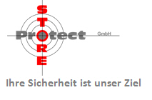

+++
title = "WEBDESIGNE FRISO TRADING"
date = "2022-01-18"
draft = false
pinned = false
image = "friso.png"
description = ""
footnotes = "https://storeprotect.ch/"
+++
**Idee** 

Wir hatten die Vorstellung eine Webseite für ein Unternehmen zu modernisieren oder so gar neu zu erstellen. Wir waren der Meinung das wir viele Ideen und neue Möglichkeiten mitbringen um so die Webseite von Friso Trading zu erneuern.

**Unser Produkt und Dienstleistung**

Unsere Dienstleistung war die Unterstützung des Marketing-Teams. Wir haben Ideen und Fotos eingebracht. Da wir jung sind und die Kundengruppe des Unternehmens auch eher junge Kunden sind, konnten wir oft unsere Meinung und Ideen dazugeben. Zudem verwalten wir jetzt auch die Instagramseite des Unternehmens. 

**Kunden**

Durch unsere Arbeit haben wir direkt keinen Kunden gewonnen, da dies eine einmalige Sache war. Was wir aber gewonnen haben sind Kontakte die nützlich sein könnten.

**Feedbacks**

Unsere Mittel und unsere Kenntnisse waren begrenzt, da wir uns mit dem Thema Webdesigne erst seit kurzem befassten. Die Rückmeldung und das Ergebnis hat jedoch gezeigt das wir, mit wenig Kapazität, viel erreichen konnten und dem Unternehmen helfen konnten.

**Erfolg**

Der grösste Erfolg war das wir das Vertrauen des Unternehmens gewonnen haben. Zudem haben wir durch unsere Leistung ein Jobangebot für eins der Tochterunternehmen erhalten. 

**Stolpersteine** 

Zu beginn war es schwierig mit den knappen Mittel aus zukommen. Nach einiger Zeit haben wir aber die Plattform für die Webseite erhalten und dies hat es und vereinfacht. Schwierig war es auch die bereits eigentliche gute Webseite anzupassen.

**Erkenntnisse** 

Aus unserer Erfahrungen können wir sagen, das Kapazität in den Bereichen Wissen und Materialen sehr wichtig sind. Vor allem wenn man für ein professionelles Unternehmen arbeitet, welches schon viel auf der Ebene des Webdesigns bietet.